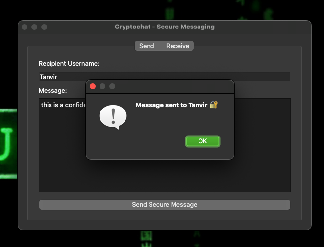
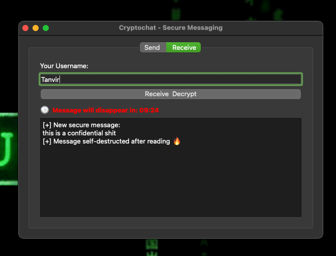

# 🔐 Cryptochat – Secure Messaging App (macOS, Python, PyQt5)

**Cryptochat** is a standalone macOS secure messaging application built with **Python** and **PyQt5**, designed with real-world cryptographic principles. It demonstrates hybrid encryption, GUI-based communication, message expiry, and secure self-destruction — all packed into a native `.app`.

> 🧠 Built as a portfolio project for Erasmus+ and cybersecurity career development.

---

## 🚀 Features

* 🔐 **End-to-End Encryption**: AES-128 + RSA-2048 hybrid model
* 🧪 **Integrity Protection**: HMAC-SHA256
* ⏳ **Self-Destructing Messages**: Based on timer or first read
* 🖥️ **Standalone GUI App**: No terminal or dependencies needed
* 💥 **Read-Once Mode**: Deletes messages after viewing
* 🍏 **Packaged for macOS** via PyInstaller

---

## 📸 Screenshots

| Sending Message        | Receiving + Countdown        |
| ---------------------- | ---------------------------- |
|  |  |

---

## 🧠 Installation (macOS App)

1. Download the latest `.app` release from [Releases](https://github.com/yourusername/cryptochat/releases)
2. Move it to your `/Applications` folder
3. Double-click to launch

> Note: If Gatekeeper blocks it, right-click → "Open" → "Allow Anyway" in **System Preferences > Security**.

---

## 🔡️ Cryptographic Architecture

| Component       | Technology Used                     |
| --------------- | ----------------------------------- |
| Encryption      | AES-128 (EAX mode)                  |
| Key Exchange    | RSA-2048                            |
| Integrity Check | HMAC-SHA256                         |
| Key Storage     | `rsa_public.pem`, `rsa_private.pem` |

Each message is:

* Encrypted with a **random AES key**
* AES key is encrypted with **recipient’s RSA public key**
* HMAC is generated for message integrity
* Metadata includes expiry and read-once flags

---

## 🧠 Why This Project?

> "Cryptochat was built as a demonstration of applied cybersecurity knowledge, ethical encryption, and user-centric security design — prepared for Erasmus+ and future-facing academic opportunities in Europe."

---

## 🗂 Project Structure

```
cryptochat/
🔹 gui_pyqt.py              # Main GUI app (compiled)
🔹 dist/Cryptochat.app      # Standalone macOS app (built with PyInstaller)
🔹 src/
├── encryption/hybrid_crypto.py
└── messaging/{sender,receiver}.py
🔹 requirements.txt
🔹 Dockerfile (optional VNC build)
```

---

## 💻 Development Setup (If You Want to Build It)

```bash
git clone https://github.com/tanviiiiir-r/Cryptochat-Secure-Messaging-App-macOS-Python-PyQt5-.git
cd cryptochat
python3 -m venv venv
source venv/bin/activate
pip install -r requirements.txt
python gui_pyqt.py
```

---

## 🛠️ Build .app Locally (Optional)

```bash
pip install pyinstaller
pyinstaller --windowed --onefile gui_pyqt.py
```

> `.app` will be in `dist/`

---

## ✨ Author

**Md Tanvir Rana** – ICT & Cybersecurity | 🇫🇮 Finland
💼 [LinkedIn](https://www.linkedin.com/in/md-tanvir-rana-770001243/)
📬 Open for Erasmus & Cybersecurity research opportunities

---

## 📄 License

This project is licensed under the **MIT License**.

```
MIT License

Copyright (c) 2025 Tanvir

Permission is hereby granted, free of charge, to any person obtaining a copy
of this software and associated documentation files (the "Software"), to deal
in the Software without restriction, including without limitation the rights
to use, copy, modify, merge, publish, distribute, sublicense, and/or sell
copies of the Software, and to permit persons to whom the Software is
furnished to do so, subject to the following conditions:

The above copyright notice and this permission notice shall be included in all
copies or substantial portions of the Software.

THE SOFTWARE IS PROVIDED "AS IS", WITHOUT WARRANTY OF ANY KIND, EXPRESS OR
IMPLIED, INCLUDING BUT NOT LIMITED TO THE WARRANTIES OF MERCHANTABILITY,
FITNESS FOR A PARTICULAR PURPOSE AND NONINFRINGEMENT. IN NO EVENT SHALL THE
AUTHORS OR COPYRIGHT HOLDERS BE LIABLE FOR ANY CLAIM, DAMAGES OR OTHER
LIABILITY, WHETHER IN AN ACTION OF CONTRACT, TORT OR OTHERWISE, ARISING FROM,
OUT OF OR IN CONNECTION WITH THE SOFTWARE OR THE USE OR OTHER DEALINGS IN THE
SOFTWARE.
```

